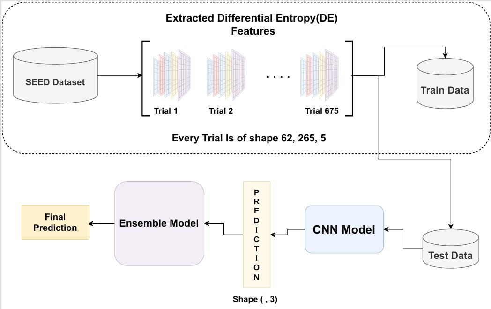

# Towards Superior EEG-Based Emotion Recognition: Integrating CNN Outputs with Machine Learning Classifiers for Enhanced Performance

This repository contains the code for the research publication titled **"Towards Superior EEG-Based Emotion Recognition: Integrating CNN Outputs with Machine Learning Classifiers for Enhanced Performance."** The paper was published at the **6th International Conference on Electrical Engineering and Information & Communication Technology (ICEEICT 2024)**. You can access the publication via the following DOI link: [https://doi.org/10.1109/ICEEICT62016.2024.10534372](https://doi.org/10.1109/ICEEICT62016.2024.10534372).

## Key Workflow

1. Train a 2D CNN using Differential Entropy (DE) features.
2. Extract CNN prediction probabilities to create a new feature vector.
3. Train ML classifiers (DT, RF, KNN, SVM) using these feature vectors.
4. Combine classifiers with a soft voting mechanism for improved accuracy.

## Proposed Workflow

## Results

- **CNN Accuracy**: 89.0%
- **Final Ensemble Accuracy**: 93.33%
